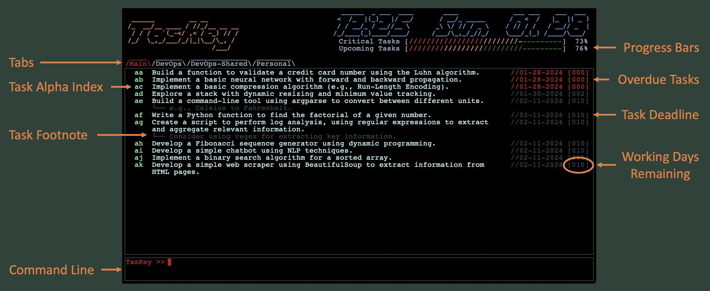

1. Add note about how progress bar precentages are calculated.
2. Add note about keyboard scrolling. 
3. Add note about windows/shared save location forward slashes. 

# TasKey

v0.0.0 (XX Feb, 2024)

[Report an Issue](https://github.com/andrewdget/TasKey/issues) | [View Changelog](https://github.com/andrewdget/TasKey/blob/main/CHANGELOG.md) | [Licensed under the MIT License](https://github.com/andrewdget/TasKey/blob/main/LICENSE.md)

## Table of Contents

<ol>
	<li><a href="url">Introduction</a></li>
	<li><a href="url">Instillation</a></li>
	<li><a href="url">Getting Started</a></li>
	<li><a href="url">Usage/Command Line Syntax
		<ol>
			<li><a href="url">Creating a Task</a></li>
			<li><a href="url">Viewing Task Information</a></li>
			<li><a href="url">Editing a Task</a></li>
			<li><a href="url">Completing a Task</a></li>
			<li><a href="url">Deleting a Task</a></li>
			<li><a href="url">Viewing Archive (Completed/Deleted Tasks)</a></li>
			<li><a href="url">Switching Tabs</a></li>
			<li><a href="url">Other Actions (Save, Prune, Kill)</a></li>
			<li><a href="url">Creating/Managing Tabs</a></li>
			<li><a href="url">Customizing Appearance</a></li>
			<li><a href="url">Other Settings</a></li>
		</ol>
	</li>
	<li><a href="url">Theory of Operation</a></li>
	<li><a href="url">Future Development</a></li>	
</ol>

## Introduction

TasKey is a ASCII based task ("to-do") management tool that is **powerful, simple, and fast.**

Many products (not just software) try to pack in so many "features" that they compromise the "easy of use" or functionality of their primary function. Conversely, there are few minimalist products that perform a single function, strive to do it well, and do nothing else... not as the result of a lack of ability, but rather clarity of purpose. 

TasKey takes inspiration from the latter. It's core design principle is to provide a task management tool that is **just powerful enough to be effective while remaining easy and fast to use.** In other words you can track/manage your tasks and then get back to whatever you were doing before! Keeping track of your tasks shouldn't become a task in and of itself.

For these reasons, TasKey uses:

<ul>
	<li>Keyboard only inputs, striking a balance between speed and simplicity.</li>
	<li>A simple but effective task management algorithm (see <a href="url">Theory of Operation</a> section) which dynamically places the most important/near-term tasks on top and lower priority tasks below.</li>
	<li>A clean, easy to read "at a glance" format.</li>
	<li>Both local and collaborative task management (see <a href="url">Creating/Managing Tabs</a> section) .</li>
</ul>

 <br>
 <p align='center'>
	
</p>

## Instillation

## Getting Started

 <br>
 <p align='center'>
	
</p>

## Usage/Command Line Syntax

TasKey utilizes a simple command line interface, based around contextual "flags" (i.e. "-a", "-b", etc.) which can be accompanied (when needed) by a string containing additional information called an "attribute", together flags and attributes form "command pairs".

**Great!... but what does that actually mean? How do we use it? Lets go through a few examples.**

Lets start off with the simplest type of command, a standalone flag. Let's say we want to switch from the main task view to the archived task view (more on this later), the following simple command is used:

```
TasKey >> -a
```

Where ```-a``` is a flag and, and because it is not followed by a string containing more information (i.e. an "attribute"), it is considered to be "standalone". These types of commands are used for general purpose commands such as changing views, setting task priority, or closing TasKey. 

When additional information is required flags may also be accompanied by a string called an "attribute". For example, when creating a new task, the following command is used: 

```
TasKey >> -n Send Jim the new working directory
```

Where ```-n``` is the flag used for creating a new task and ```Send Jim the new working directory``` is an attribute representing the name of the task, together they form a "command pair".

Some commands may include more than one set of command pairs (flags/attributes). For example, we want to create the same task used in the last example, but this time we want to set it as a high priority and set a deadline:

```
TasKey >> -n Send Jim the new working directory -h -d 02202024
```

Where the ```-n Send Jim the new working directory``` command pair is used the same, but also included is the standalone flag ```-h``` which represents the tasks priority and the ```-d``` flag used to set a deadline paired with an attribute representing the deadline date, in this case ```02202024``` (Feb 20, 2024).

Now that there are multiple flags being used, we must distinguish between "leader" and "follower" flags.

<ul>
	<li>Leader flags, as their name suggest, are the first flag used in a command (<code>-n</code> in the example above).</li>
	<li>Follower flags are any flag that comes after the leader flag (<code>-h</code> and <code>-d</code> in the example above).</li>
</ul>

The order of follower flags is unimportant. For example, the command above could be reordered as follows and would have the same result:

```
TasKey >> -n Send Jim the new working directory -d 02202024 -h
```

However, leader flags must be chosen with care as they determine the interpretation of the follower flags. For example the flag ```-d``` used above, as a follower, is used to set a deadline... but as a leader flag, ```-d``` is used to delete a task.

This is the basic format of all TasKey commands. Below are usage guides for all available TasKey command pairs.

### Creating a New Task ```-n```

Creating and new task is the most fundamental function of any task management application. With TasKey this can be done quickly with a standalone flag followed by the name of the task, the default settings will take care of the rest. For example:

```
TasKey >> -n Send Jim the new working directory
```

However, if more control is required (for example setting a level of priority for a task, or giving it a deadline for completion), the follower flags below, provide additional control:


**Add a Footnote** ```-f``` [Attribute Required]<br>Allows for the inclusion of additional information, reminders, context, et cetera for the task. Footnotes are optional, if none is given, none will be included. For example:

```
TasKey >> -n Send Jim the new working directory -f The one created on Wednesday
```

**Set Task Priority** ```-l``` (low), ```-m``` (medium), ```-h``` (high), ```-c``` (critical) [Standalone Flag]<br>Task priority essentialy influences how quickly that task will be at the top of the task list. Naturaly, taks with higher priority will be prioritized over other task with similar deadlines/number of remaining working days to complete (see [theory of operation](url)). Furthermore, if a deadline is not manually set for the task, tasks priority determines the date that a deadline is automatically set (see [other settings](url)). If no priority is set, the priority defaults to medium. For example, creating a high priority task:

```
TasKey >> -n Send Jim the new working directory -h
```

**Set Task Deadline** ```-d``` [Formated Attribute Required]<br>All TasKey tasks are given a deadline at creation, if not done manualy, this deadline is set based on task priority (the default is medium, see [theory of operation](url) and [other settings](url)). However, when desired a task can be given a specific deadline (in MMDDYYYY) format, for example:

```
TasKey >> -n Send Jim the new working directory -d 02182024
```

**New Task Follower Flag Summary**

| Action |   Follower Flags   | Default |
| --- | --- | --- |
| Add Footnote | ```-f``` | ```None``` |
| Set Priority | ```-l```, ```-m```, ```-h```, ```-c``` | ```-m``` |
| Set Deadline | ```-d```| Set automaticaly by priority. |

### Editing a Task ```-e```


