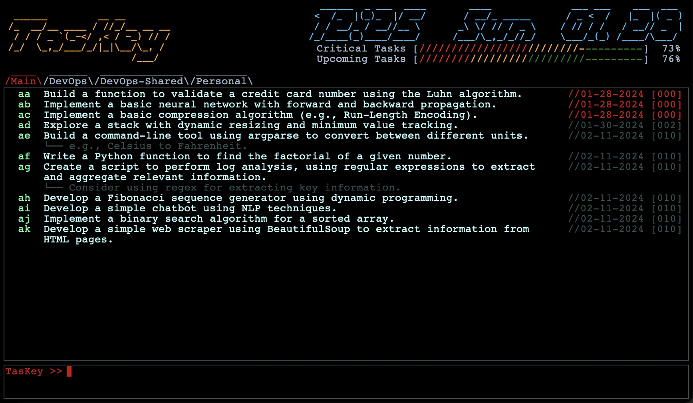

# TasKey

v0.0.0 (XX Feb, 2024)

[Report an Issue](https://github.com/andrewdget/TasKey/issues) | [View Changelog](https://github.com/andrewdget/TasKey/blob/main/CHANGELOG.md) | [Licensed under the MIT License](https://github.com/andrewdget/TasKey/blob/main/LICENSE.md)

## Table of Contents

<ol>
	<li><a href="url">Introduction</a></li>
	<li><a href="url">Instillation</a></li>
	<li><a href="url">Getting Started</a></li>
	<li><a href="url">Usage
		<ol>
			<li><a href="url">Creating a Task</a></li>
			<li><a href="url">Viewing Task Information</a></li>
			<li><a href="url">Editing a Task</a></li>
			<li><a href="url">Completing a Task</a></li>
			<li><a href="url">Deleting a Task</a></li>
			<li><a href="url">Viewing Archive (Completed/Deleted Tasks)</a></li>
			<li><a href="url">Switching Tabs</a></li>
			<li><a href="url">Other Actions (Save, Prune, Kill)</a></li>
			<li><a href="url">Creating/Managing Tabs</a></li>
			<li><a href="url">Customizing Appearance</a></li>
			<li><a href="url">Other Settings</a></li>
		</ol>
	</li>
	<li><a href="url">Theory of Operation</a></li>
	<li><a href="url">Future Development</a></li>	
</ol>

## Introduction

TasKey is a ASCII based task ("to-do") management tool that is **powerful, simple, and fast.**

Many products (not just software) try to pack in so many "features" that they compromise the "easy of use" or functionality of their primary function. Conversely, there are few minimalist products that perform a single function, strive to do it well, and do nothing else... not as the result of a lack of ability, but rather clarity of purpose. 

TasKey takes inspiration from the latter. It's core design principle is to provide a task management tool that is **just powerful enough to be effective while remaining easy and fast to use.** In other words you can track/manage your tasks and then get back to whatever you were doing before! Keeping track of your tasks shouldn't become a task in and of itself.

For these reasons, TasKey uses:

<ul>
	<li>Keyboard only inputs, striking a balance between speed and simplicity.</li>
	<li>A simple but effective task management algorithm (see <a href="url">Theory of Operation</a> section) which dynamically places the most important/near-term tasks on top and lower priority tasks below.</li>
	<li>A clean, easy to read "at a glance" format.</li>
	<li>Both local and collaborative task management (see <a href="url">Creating/Managing Tabs</a> section) .</li>
</ul>

  
 

	
	 <b>Example of TasKey Interface</b>

## Instillation

